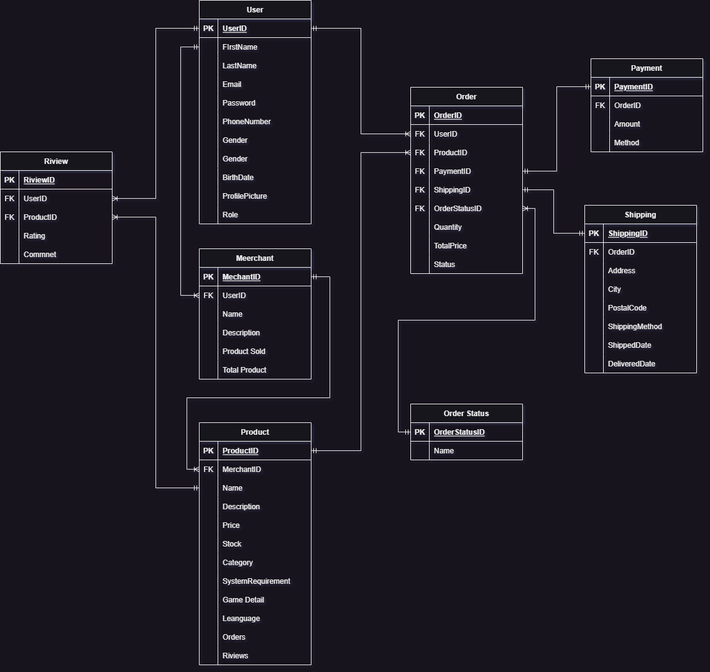

# Gasruk - Digital Voucher Marketplace

This project is a backend system for a digital voucher marketplace application. The application supports multi-merchant platforms where each merchant can manage their own store, upload both digital and physical products, and serve buyers.

## Table of Contents
- [ERD (Entity Relationship Diagram)](#erd)
- [Database Configuration](#database-configuration)
- [Running the Application](#running-the-application)

---

## ERD
Below is the Entity Relationship Diagram (ERD) for this application, outlining the key relationships between the tables:



## Database Configuration

### Setting up the Database

To run the application, ensure that you have a PostgreSQL database running. The database credentials need to be properly configured in the `app.go` file.

### DSN Configuration

In the `app.go` file, the Data Source Name (DSN) string is used to connect to the PostgreSQL database. If your database credentials are different from the defaults, modify the `dsn` string in the `app.go` file accordingly.

Open `app.go` and find the following line:

```go
dsn := "host=localhost user=postgres password=cimapag1 dbname=gasruk port=5432 sslmode=disable TimeZone=Asia/Jakarta"
