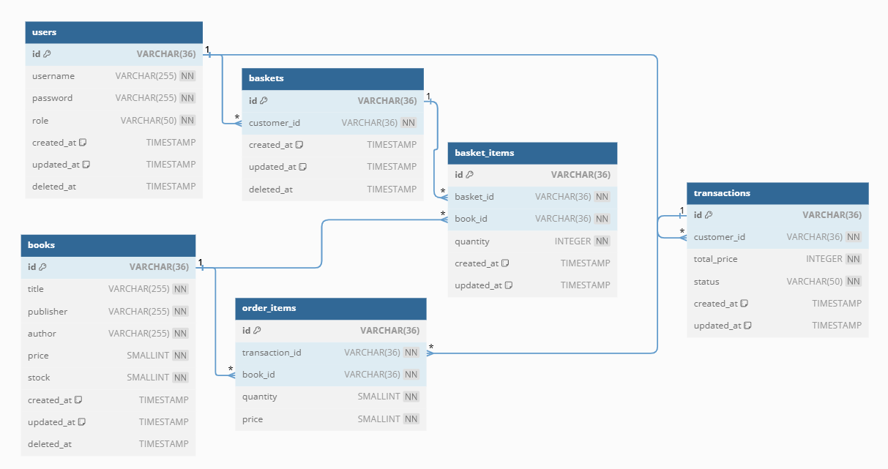

# **REST API CRUD BOOK STORE**

Books store application built with [Golang](https://go.dev/) using the [Gin framework](github.com/gin-gonic/gin), [SQLite](https://github.com/go-gorm/sqlite), and [Gorm](https://gorm.io/). The JSON responses are designed in a way that is easy to interpret and use.

## Entity-Relationship Diagram (ERD)

To provide a clearer picture of the database structure for this project, we have included an Entity-Relationship Diagram (ERD) that illustrates the relationships between tables and the attributes involved.
### ERD Diagram



## Tech Stack

**Language:** Golang \
**Server:** Gin \
**ORM:** GORM \
**Database:** SQLite \
**Authentication:** JWT (JSON Web Tokens)

## Project Structure

This project follows a structured approach to maintain clarity and organization. Below is an overview of the directory structure:

```
smkdev-task-3
├── assets
│ └── erd.png
├── cmd
│ └── main.go
├── pkg
│ ├── config
│ │ └── app.go
│ ├── controllers
│ │ └── auth-controller.go
│ │ └── basket-controllers.go
│ │ └── book-controllers.go
│ │ └── transaksi-controllers.go
│ │ └── transaksi-controllers.go
│ ├── database
│ │ ├── bookstore.db
│ ├── models
│ │ └── basket.go
│ │ └── book.go
│ │ └── transaksi.go
│ │ └── user.go
│ ├── middlewares
│ │ └── jwt.go
│ ├── repository
│ │ └── auth.go
│ │ └── basket.go
│ │ └── book.go
│ │ └── transaksi.go
│ ├── routes
│ │ └── bookstore-routes.go
│ ├── service
│ │ └── auth.go
│ │ └── basket.go
│ │ └── book.go
│ │ └── transaksi.go
│ ├── utils
│ └──── utils.go
├── go.mod
├── go.sum
└── readme.md
```

## Run Locally

Clone the project

```bash
  git clone https://github.com/smkdev-id/smkdev-gits-academy.git
```

Go to the project directory

```bash
  cd smkdev-gits-academy/backend/smkdev-task-3/
```

Start the server

```bash
  go run cmd/main.go (running main.go)
```

URLs are provided in responses they will be rendered as if service
is running on 'http://localhost:8080/'.

# API

## Endpoints

### Authentication
- `POST /register/`: Register a new user
- `POST /login/`: Login and receive a JWT token\
### Headers:

- Authorization: Bearer {token}
### Admin Routes
All admin routes require a valid admin JWT token in the Authorization header.

#### Books Management
- `GET /admin/books`: Get all books
- `GET /admin/books/:id`: Get a specific book by ID
- `POST /admin/books`: Create a new book
- `PUT /admin/books/:id`: Update a book
- `DELETE /admin/books/:id`: Delete a book

#### Transaction Management
- `GET /admin/transactions`: Get all transactions
- `GET /admin/transactions/:id`: Get a specific transaction by ID
- `PATCH /admin/transactions/:id/status`: Update transaction status

### Customer Routes
All customer routes require a valid customer JWT token in the Authorization header.

#### Books
- `GET /customer/books`: Get all available books
- `GET /customer/books/:id`: Get a specific book by ID

#### Basket Management
- `GET /customer/basket`: Get the current user's basket
- `POST /customer/basket`: Add an item to the basket
- `PUT /customer/basket`: Update an item in the basket
- `DELETE /customer/basket/:book_id`: Remove an item from the basket
- `DELETE /customer/basket`: Clear the entire basket

#### Transaction Management
- `POST /customer/transactions`: Create a new transaction from the basket
- `GET /customer/transactions`: Get all transactions for the current user
- `GET /customer/transactions/:id`: Get a specific transaction by ID transaction

## How To Use

### Authentication
### Headers:

- Authorization: Bearer {token}
#### Register
- **POST** ` /register/`

  **Request:**

  - **Body:**

    ```json
    {
      "username":"KONICCO",
      "password":"1",
      "role":"admin"  change [admin or customer]
    }
#### Login
- **POST** ` /login`

  **Request:**

  - **Body:**

    ```json
    {
      "username":"CUSTOMER A",
      "password":"1"
    }
### Admin Endpoints

#### Get All Books (Admin)
- **GET** `/admin/books/`

  **Response:**

  - **Body:**

    ```json
    [
    {
      "ID": "string",
      "Title": "string",
      "Publisher": "string",
      "Author": "string",
      "Price": number,
      "Stock": number,
      "CreatedAt": "string",
      "UpdatedAt": "string",
      "DeletedAt": "string"
    }
    ]
#### Get Books by ID (Admin)

- **GET** `/admin/books/:id`

  **Response:**

  - **Body:**

    ```json
    {
      "ID": "string",
      "Title": "string",
      "Publisher": "string",
      "Author": "string",
      "Price": number,
      "Stock": number,
      "CreatedAt": "string",
      "UpdatedAt": "string",
      "DeletedAt": "string"
    }
#### Create Book (Admin)
- **POST** `/admin/books/`

  **Request:**
  - **Body**:
    ```json
    {
      "title": "Book Title",
      "author": "Author Name",
      "publisher": "Publisher Name",
      "price": 100,
      "stock": 100
    }
#### Delete Book (Admin)
- **DELETE** `/admin/books/:id`
#### Get All Transactions (Admin)
- **GET** `/admin/transactions`
#### Get Transaction by ID (Admin)
- **GET** `/admin/transactions/:id`
#### Update Transaction Status (Admin)
- **PATCH** `/admin/transactions/:id/status`

  **Request:**

  - **Body:**
    ```json
      {
        "status": "completed"
      }
    ```
### Customer Endpoints
#### Get All Books (Customer)

- **GET** `/customer/books/`

    **Response:**

    - **Body:**

    ```json
    [
        {
        "ID": "string",
        "Title": "string",
        "Publisher": "string",
        "Author": "string",
        "Price": number,
        "Stock": number,
        "CreatedAt": "string",
        "UpdatedAt": "string",
        "DeletedAt": "string"
        }
    ]
#### Get Books by ID (Customer)

- **GET:** `/customer/books/:id`

#### Get All Basket (Customer)
- **GET** `/customer/transactions`
#### Create Book to Basket (Customer)
- **POST** `/customer/basket/`

    **Request:**

    - **Body:**

    ```json
    {
        "book_id": "67ed9baa-953d-47a2-bc7a-ca8d8a52686b",
        "quantity": 7
    }
#### Delete Book From  Basket(Customer)
- **DELETE** `/customer/baskets/:book_id`
#### Clear Basket (Customer)
- **DELETE** `/customer/baskets/`
#### Get All Transactions (Customer)
- **GET** `/customer/transactions`
#### Get Transaction by ID Transaction (Customer)
**Response:**
- **GET** `/customer/transactions/:id`
  ```json
  {
  "id": "efe53176-d390-4658-a2cb-969edcea06fc",
  "customer_id": "779db560-2860-4760-a5c0-4d5742546234",
  "items": [
    {
      "id": "df2b03d9-9a10-4df8-80dc-3a0b9b39387a",
      "transaction_id": "efe53176-d390-4658-a2cb-969edcea06fc",
      "book_id": "67ed9baa-953d-47a2-bc7a-ca8d8a52686b",
      "quantity": 5,
      "price": 1999,
      "book": {
        "id": "67ed9baa-953d-47a2-bc7a-ca8d8a52686b",
        "title": "ccccccccccccccccccccccccccccccc",
        "publisher": "sidu",
        "author": "Author Name",
        "price": 1999,
        "stock": 100,
        "created_at": "2024-08-04T21:34:59.9685072+07:00",
        "updated_at": "2024-08-04T21:34:59.9685072+07:00",
        "deleted_at": null
      }
    },
    {
      "id": "c82254ce-e8b9-4a27-b2fc-16042f8cf927",
      "transaction_id": "efe53176-d390-4658-a2cb-969edcea06fc",
      "book_id": "4354bdfa-1b13-4556-ad6e-e8349d0d6861",
      "quantity": 5,
      "price": 1999,
      "book": {
        "id": "4354bdfa-1b13-4556-ad6e-e8349d0d6861",
        "title": "aaaaaaaaaaaaaaaaaaaaaaa",
        "publisher": "sidu",
        "author": "Author Name",
        "price": 1999,
        "stock": 100,
        "created_at": "2024-08-04T21:34:45.4224764+07:00",
        "updated_at": "2024-08-04T21:34:45.4224764+07:00",
        "deleted_at": null
      }
    }
  ],
  "total_price": 19990,
  "status": "completed",
  "created_at": "2024-08-04T23:11:58.4116486+07:00",
  "updated_at": "2024-08-05T13:47:22.4876609+07:00"
  }
#### Create Transaction (Customer)
- **POST** `/customer/transactions/`

